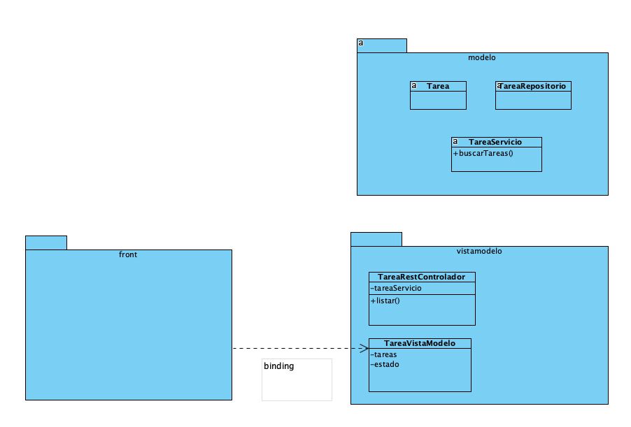

## Crear aplicacion MVVM
>::
- Es una aplicacion web para la gestion de Tareas
- Se debe hacer un CRUD de Tarea ( mostar las tareas)
- Cada Tarea debe tener
    - Identificador
    - Titulo
    - Saber si esta completada o no

El backend : Spring Boot
El frontend : Con el framework que domines

